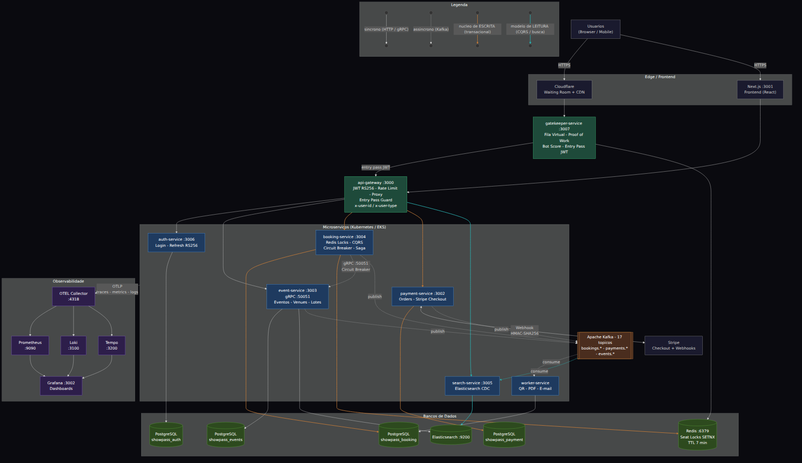
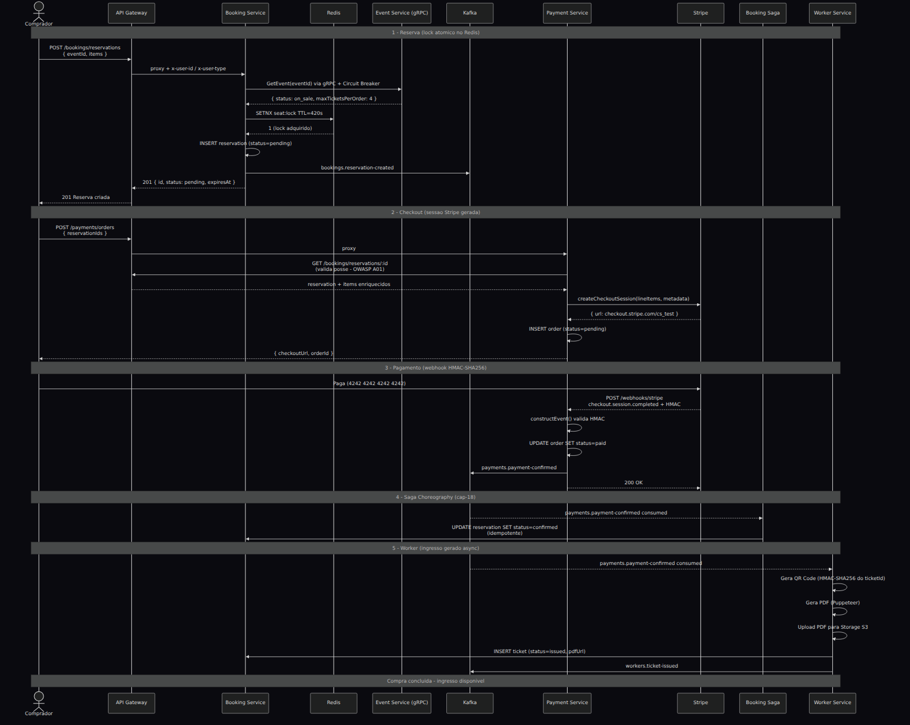

# Arquitetura ShowPass — Referência Visual

> Diagramas renderizados automaticamente no GitHub, VS Code (extensão Mermaid) e Notion.
> Para detalhes de implementação, ver `docs/cap-XX-*.md`.

---

## Animação (GIF para apresentações / LinkedIn)


> GIF animado mostrando a stack + o fluxo de compra passo a passo. Fonte e instruções
> de regeneração em [`diagrams/anim/`](diagrams/anim/README.md).

---

## Diagrama 1 — Arquitetura Completa



> PNG renderizado em `docs/diagrams/01-arquitetura-completa.png`. Para regenerar
> após editar o `.mmd`, ver [Como regenerar os diagramas](#como-regenerar-os-diagramas).

> **Fonte (single source of truth):** [`diagrams/01-arquitetura-completa.mmd`](diagrams/01-arquitetura-completa.mmd) — edite esse arquivo e regenere o PNG.

---

## Diagrama 2 — Fluxo Completo de Compra



> PNG renderizado em `docs/diagrams/02-fluxo-compra.png`.

> **Fonte (single source of truth):** [`diagrams/02-fluxo-compra.mmd`](diagrams/02-fluxo-compra.mmd) — edite esse arquivo e regenere o PNG.

---

## Como regenerar os diagramas

Os arquivos-fonte estão em `docs/diagrams/*.mmd`. Após editá-los, regere os PNGs:

```bash
# Instalar o Mermaid CLI (uma vez)
npm install -g @mermaid-js/mermaid-cli

# Regenerar (em ambientes WSL/CI, o --no-sandbox é necessário — ver puppeteer-config.json)
mmdc -i docs/diagrams/01-arquitetura-completa.mmd \
     -o docs/diagrams/01-arquitetura-completa.png \
     -t dark -b '#0a0a0f' -s 2

mmdc -i docs/diagrams/02-fluxo-compra.mmd \
     -o docs/diagrams/02-fluxo-compra.png \
     -t dark -b '#0a0a0f' -s 2
```

Flags: `-t dark` (tema escuro) · `-b` (cor de fundo) · `-s 2` (escala 2x para nitidez).

---

## Regras de comunicação entre serviços

| Tipo | Protocolo | Quando usar |
|---|---|---|
| **Síncrono crítico** | HTTP/REST via Gateway | Buyer ↔ serviços (requests com JWT) |
| **Síncrono interno** | gRPC (Protobuf, HTTP/2) | booking → event (latência crítica, ~40% mais rápido) |
| **Assíncrono** | Kafka (at-least-once) | Eventos de domínio (confirmação, geração de ticket) |
| **NUNCA** | SQL cross-service | Cada serviço acessa só seu próprio banco |

## Serviços e portas (dev local)

| Serviço | Porta HTTP | Porta gRPC | Banco |
|---|---|---|---|
| api-gateway | 3000 | — | — |
| gatekeeper-service (cap-19) | 3007 | — | Redis (fila, PoW, bot score) |
| auth-service | 3006 | — | showpass_auth |
| event-service | 3003 | 50051 | showpass_events |
| booking-service | 3004 | — | showpass_booking |
| payment-service | 3002 | — | showpass_payment |
| search-service | 3005 | — | Elasticsearch |
| worker-service | — | — | showpass_booking (tickets) |
| web (Next.js) | 3001 | — | — |

## Invariantes de negócio

1. **Double booking = impossível** — Redis SETNX atômico (Lua script)
2. **Assento disponível** = `status='available'` no Postgres **E** sem lock no Redis
3. **Lock TTL = 7 min** (Redis expira automaticamente) = Reservation TTL = 7 min (cron job expira no banco)
4. **Pagamento idempotente** — SHA-256 hash dos reservationIds como idempotency key no Stripe
5. **QR Code inforjável** — assinado HMAC-SHA256 com chave secreta do worker
6. **Refresh token seguro** — armazenado como SHA-256 hash no banco (vazamento não expõe o token real)
7. **Saga com compensação** — `payment.failed` cancela reservas e libera locks imediatamente (não espera TTL)
